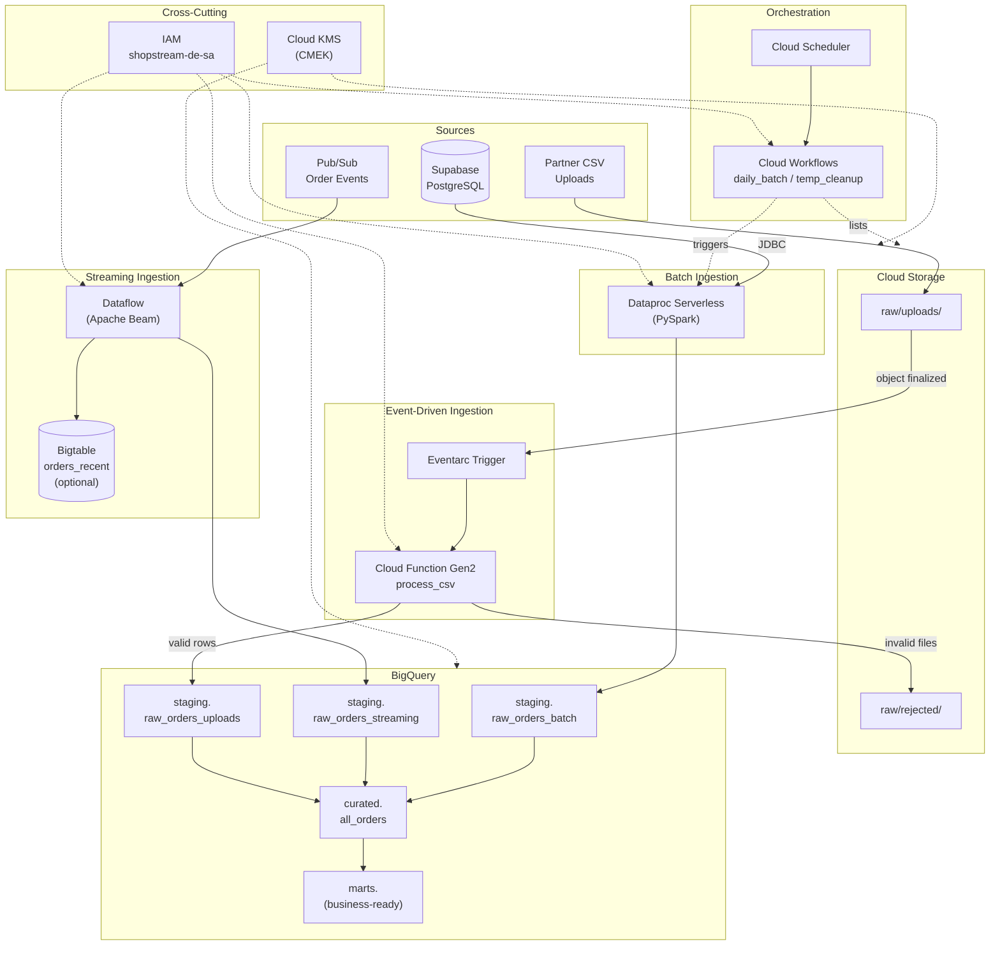

# ShopStream: Ultra-Low-Cost GCP Data Platform

An end-to-end data engineering portfolio project demonstrating batch, streaming, and event-driven data ingestion into Google Cloud Platform (GCP) using serverless and managed services.

## Architecture Overview
*   **Source:** Supabase (PostgreSQL), Pub/Sub streams, GCS CSV Uploads
*   **Batch Ingestion:** Dataproc Serverless (PySpark)
*   **Streaming Ingestion:** Cloud Pub/Sub & Dataflow (Apache Beam)
*   **Event-driven Ingestion:** Eventarc & Cloud Functions Gen2
*   **Storage & Analytics:** Google Cloud Storage, BigQuery, Bigtable (Optional)
*   **Orchestration:** Cloud Workflows & Cloud Scheduler

## Architecture Diagram



## Prerequisites

1.  **Google Cloud Platform Account:** With an active billing account (or free trial).
2.  **Google Cloud CLI (`gcloud`):** Installed and authenticated locally.
3.  **Python 3.9+:** Installed locally.
4.  **Git Bash (Recommended for Windows):** For executing bash scripts.
5.  **Supabase Account:** Free tier PostgreSQL database.

## 1. Local Setup & Environment Variables

1. Clone this repository.
2. Create your `.env` file from the example:
   * **Linux/macOS:** `cp .env.example .env`
   * **Windows:** `copy .env.example .env`
3. Fill in your specific GCP and Supabase credentials in the `.env` file.
4. Load the environment variables into your terminal session:

**Linux / macOS / Git Bash:**
```bash
source .env
```

**Windows (PowerShell):**
```powershell
Get-Content .env | Where-Object { $_ -match '=' -and -not $_.StartsWith('#') } | ForEach-Object {
    $name, $value = $_.Split('=', 2)
    Set-Variable -Name $name.Trim() -Value $value.Trim()
}
```

## 2. Source Database Setup (Supabase)

Before running the pipelines, seed your Supabase PostgreSQL database using the provided files in the `data/` directory:
1. Open the Supabase SQL Editor.
2. Run the contents of `data/01_create_orders.sql` to create the schema.
3. Run the contents of `data/02_seed_orders.sql` to populate initial batch data.

## 3. Infrastructure Provisioning

Run the provided bash scripts in sequence to provision the GCP resources. *(Ensure you are using Git Bash if on Windows).*

```bash
bash infra/01_project.sh
bash infra/02_apis.sh
bash infra/03_iam.sh
bash infra/04_kms_gcs.sh
bash infra/05_pubsub.sh
# bash infra/06_bigtable.sh (Optional: Uncomment if deploying Bigtable)
```

## 4. Pipeline Execution

### A. Batch Pipeline (Dataproc Serverless)
Extracts historical data from Supabase to BigQuery.

1. Download the PostgreSQL JDBC Driver (amend with appropriate version):
```bash
curl -L -o third_party/postgresql-42.7.7.jar https://jdbc.postgresql.org/download/postgresql-42.7.7.jar
gcloud storage cp third_party/postgresql-42.7.7.jar "gs://${BUCKET}/spark/"
```

2. Upload the PySpark script and submit the job:
```bash
gcloud storage cp spark/batch_orders.py "gs://${BUCKET}/spark/"

gcloud dataproc batches submit pyspark \
  "gs://${BUCKET}/spark/batch_orders.py" \
  --batch="shopstream-batch-$(date +%Y%m%d-%H%M%S)" \
  --region="$REGION" \
  --deps-bucket="$BUCKET" \
  --service-account="$SA_EMAIL" \
  --jars="gs://${BUCKET}/spark/postgresql-42.7.7.jar" \
  -- \
  --jdbc-url="$PG_JDBC_URL" \
  --jdbc-user="$PG_USER" \
  --jdbc-password="$PG_PASSWORD" \
  --target-project="$PROJECT_ID" \
  --target-dataset="shopstream_staging" \
  --target-table="raw_orders_batch"
```

### B. Streaming Pipeline (Dataflow & Pub/Sub)
Processes real-time simulated order events.

1. Install local dependencies:
```bash
pip install -r beam/requirements.txt
```

2. Launch the Dataflow job:
```bash
python beam/streaming_orders.py \
  --runner=DataflowRunner \
  --project="$PROJECT_ID" \
  --region="$REGION" \
  --service_account_email="$SA_EMAIL" \
  --staging_location="gs://${BUCKET}/dataflow/staging" \
  --temp_location="gs://${BUCKET}/dataflow/temp" \
  --input_subscription="projects/${PROJECT_ID}/subscriptions/${PUBSUB_SUB}" \
  --output_table="${PROJECT_ID}:shopstream_staging.raw_orders_streaming"
```

3. Simulate live events using the provided JSONL data (or run `beam/publish_events.py`):
```bash
while IFS= read -r line; do
  gcloud pubsub topics publish "$PUBSUB_TOPIC" --message="$line"
done < data/orders_events.jsonl
```

*Note: Cancel the Dataflow job via the GCP Console or CLI immediately after testing to prevent ongoing costs.*

### C. Event-Driven Pipeline (Cloud Functions Gen2)
Processes CSV files upon upload to GCS.

1. Deploy the Cloud Function:
```bash
cd function
gcloud functions deploy shopstream-csv-ingest \
  --gen2 \
  --region="$REGION" \
  --runtime=python311 \
  --source=. \
  --entry-point=process_csv \
  --service-account="$SA_EMAIL" \
  --trigger-location="$REGION" \
  --trigger-event-filters="type=google.cloud.storage.object.v1.finalized" \
  --trigger-event-filters="bucket=${BUCKET}"
cd ..
```

2. Upload CSV files to trigger the function:
```bash
gcloud storage cp data/valid_orders.csv "gs://${BUCKET}/raw/uploads/"
gcloud storage cp data/missing_column_orders.csv "gs://${BUCKET}/raw/uploads/"
gcloud storage cp data/negative_quantity_orders.csv "gs://${BUCKET}/raw/uploads/"
```

## 5. Orchestration (Workflows & Cloud Scheduler)

Automate the Batch job and GCS temp file cleanup.

```bash
bash infra/07_orchestration.sh
```

## 6. Verification & Data Modeling

1. Verify row counts across all raw tables:
```bash
bq query --use_legacy_sql=false "
SELECT 'batch' AS source, COUNT(*) AS rows FROM \`${PROJECT_ID}.shopstream_staging.raw_orders_batch\`
UNION ALL
SELECT 'streaming', COUNT(*) FROM \`${PROJECT_ID}.shopstream_staging.raw_orders_streaming\`
UNION ALL
SELECT 'uploads', COUNT(*) FROM \`${PROJECT_ID}.shopstream_staging.raw_orders_uploads\`
"
```

2. Run the SQL queries documented in `docs/architecture.md` within the BigQuery Console to construct the Curated and Mart layers.

## 7. Teardown & Cleanup

To avoid unexpected GCP charges, execute the cleanup script to remove billable resources:

```bash
bash infra/99_cleanup.sh
```
